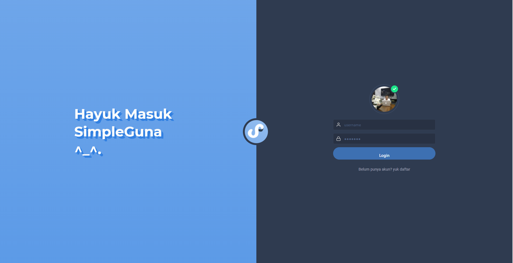
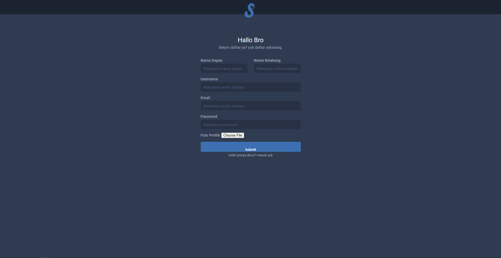
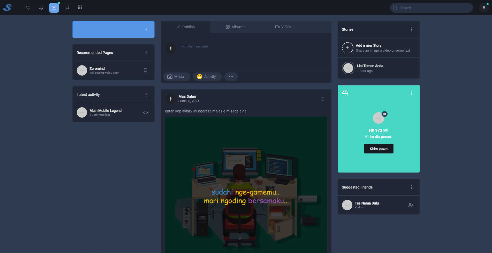
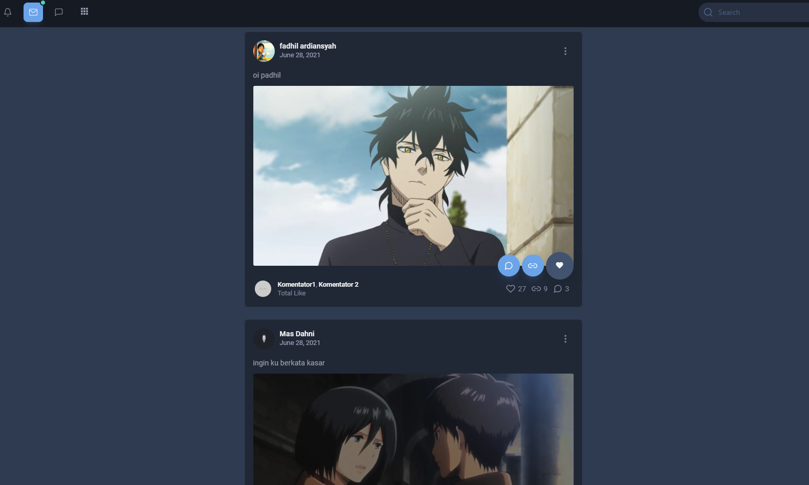
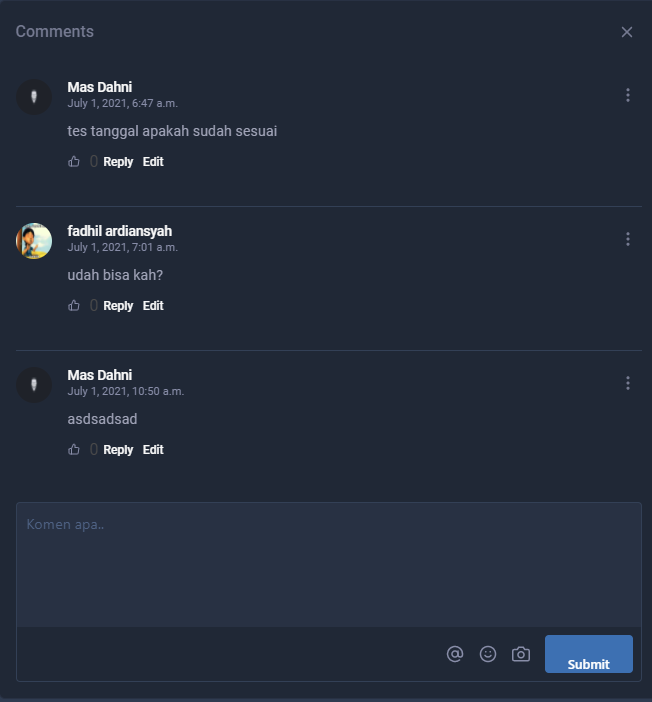

# Social Media With Django

## [INFO]
```
Move folder img to assets
```

## [CONFIGURATION]
Set your database and time zome in `SimpleGuna/settings.py`

```python
DATABASES = {
    'default': {
        'ENGINE': 'django.db.backends.mysql',
        'NAME': 'SimpleGuna', #change this with your name database
        'USER': 'zeromind', #change this with your user database
        'PASSWORD' : '1', # change this with your password database
        'HOST' : '127.0.0.1',
        'PORT': '3306',
    }
}


TIME_ZONE = 'Asia/Jakarta' #change with your time zone

```

## Screenshoot / Demo
### Login page


### Register Page


### Home page



### Comment


if you want to work together and help develop this social media, just pull request
